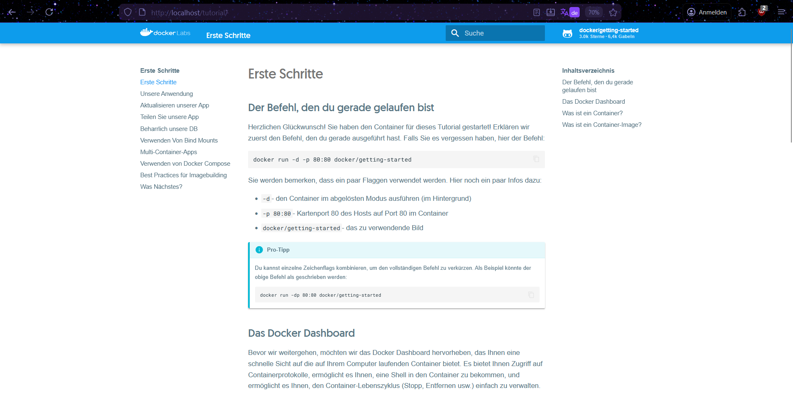
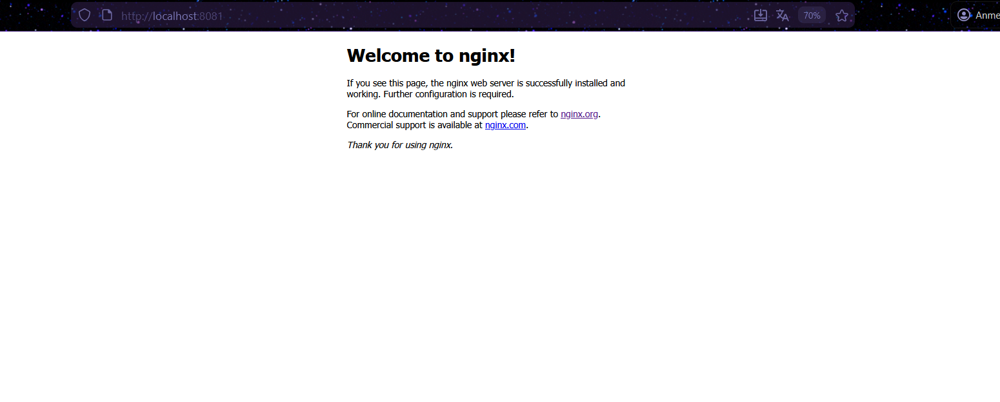
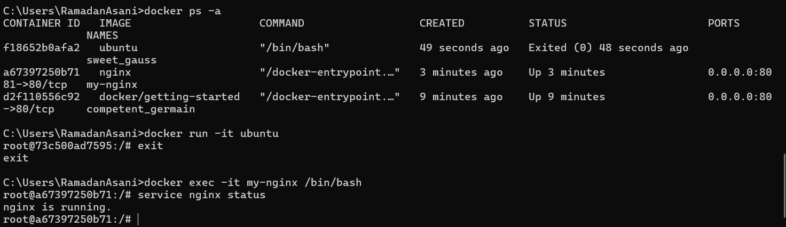
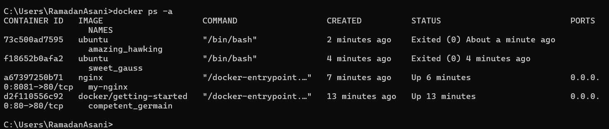
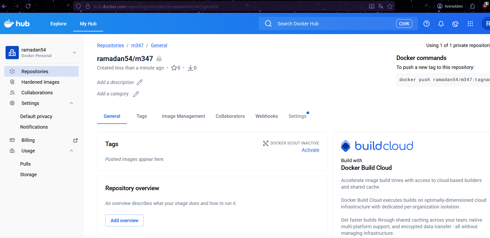
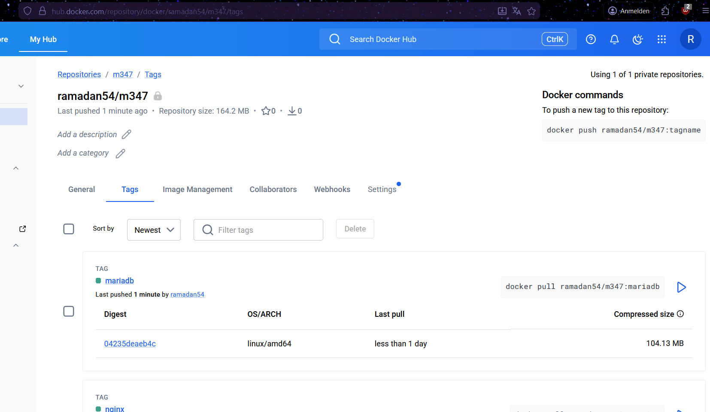

# KN01: Docker Grundlagen

---

## A) Installation (20%)

### Docker Desktop installiert und erster Container gestartet

Der erste Container wurde mit folgendem Befehl gestartet:

```bash
docker run -d -p 80:80 docker/getting-started
```

**Screenshot der Webseite nach dem Erstellen des ersten Containers:**



**Screenshot des Containers in Docker Desktop:**


---

## B) Docker Command Line Interface (CLI) (50%)

### 1. Docker-Version überprüfen

```bash
docker version
```

Dieser Befehl zeigt die installierte Docker-Version an (Client und Server).

**Ausgabe:**
```
Client:
 Version:           28.0.1
 API version:       1.48
 Go version:        go1.23.6
 OS/Arch:           windows/amd64

Server: Docker Desktop 4.39.0 (184744)
 Engine:
  Version:          28.0.1
  API version:      1.48
  OS/Arch:          linux/amd64
```

### 2. Docker Hub durchsuchen

```bash
docker search ubuntu
docker search nginx
```

Diese Befehle durchsuchen Docker Hub nach den offiziellen Images. In der Spalte `OFFICIAL` steht `[OK]` bei den offiziellen Images.

### 3. Erklärung des Befehls aus Teil A

```bash
docker run -d -p 80:80 docker/getting-started
```

| Parameter | Erklärung |
|---|---|
| `docker run` | Erstellt und startet einen neuen Container aus einem Image |
| `-d` | **Detached mode** – Der Container läuft im Hintergrund, das Terminal bleibt frei |
| `-p 80:80` | **Port-Mapping** – Port 80 des Host-Systems (links) wird auf Port 80 im Container (rechts) weitergeleitet. So kann man im Browser über `localhost:80` auf den Container zugreifen |
| `docker/getting-started` | Der Name des Images auf Docker Hub (Benutzer: `docker`, Image: `getting-started`) |

### 4. nginx – Pull, Create, Start (einzeln)

Dies zeigt, dass `docker run` das gleiche ist wie `docker pull` + `docker create` + `docker start`.

**Image herunterladen:**

```bash
docker pull nginx
```

**Container erstellen:**

```bash
docker create --name my-nginx -p 8081:80 nginx
```

**Container starten:**

```bash
docker start my-nginx
```

**Screenshot der nginx-Standardseite (http://localhost:8081):**



### 5. Ubuntu – Hintergrund vs. Interaktiv

**5a) Ubuntu im Detached-Modus:**

```bash
docker run -d ubuntu
```

Wenn man den Ubuntu-Container im Detached-Modus (`-d`) startet, wird das Image zuerst automatisch heruntergeladen, da es lokal noch nicht vorhanden war. Danach wird der Container erstellt und gestartet. Allerdings stoppt der Container sofort wieder, weil Ubuntu kein laufendes Programm (wie z.B. einen Webserver) im Vordergrund hat. Ohne einen Prozess, der dauerhaft läuft, beendet sich der Container automatisch. Mit `docker ps -a` sieht man den Status "Exited".

**5b) Ubuntu im interaktiven Modus:**

```bash
docker run -it ubuntu
```

Mit den Flags `-it` (interactive + terminal) wird der Container gestartet und gleichzeitig eine interaktive Shell (Bash) geöffnet. Man befindet sich nun direkt innerhalb des Containers und sieht eine Linux-Kommandozeile (z.B. `root@73c500ad7595:/#`). Der Container bleibt so lange aktiv, wie die Shell offen ist. Man kann Linux-Befehle ausführen, als wäre man auf einem eigenständigen Ubuntu-System. Zum Verlassen gibt man `exit` ein, woraufhin der Container stoppt.

### 6. Interaktive Shell im laufenden nginx-Container

```bash
docker exec -it my-nginx /bin/bash
```

Innerhalb des Containers:

```bash
service nginx status
```

**Screenshot des Befehls und Resultats:**



Mit `exit` wurde die Shell verlassen. Der Container läuft danach weiter, da nur eine zusätzliche Shell geöffnet wurde und nicht der Hauptprozess.

### 7. Status der Container überprüfen

```bash
docker ps -a
```

Dieser Befehl zeigt alle Container an (laufende und gestoppte). Ohne `-a` werden nur laufende Container angezeigt.

**Screenshot:**



### 8. nginx-Container stoppen

```bash
docker stop my-nginx
```

### 9. Alle Container entfernen

```bash
for /f %i in ('docker ps -aq') do docker rm %i
```

Der Befehl `docker ps -aq` listet alle Container-IDs auf. `docker rm` entfernt die Container. Laufende Container müssen vorher mit `docker stop` gestoppt werden.

### 10. Images entfernen

```bash
docker rmi nginx
docker rmi ubuntu
```

Der Befehl `docker rmi` (remove image) löscht die lokal gespeicherten Docker-Images.

---

## C) Registry und Repository (10%)

Ein Account wurde auf Docker Hub mit der TBZ-Email erstellt. Das private Repository `m347` wurde angelegt.

**Login im Terminal:**

```bash
docker login
```

**Screenshot des leeren Repository:**



---

## D) Privates Repository (20%)

### 1. nginx-Image taggen

```bash
docker pull nginx
docker tag nginx:latest ramadan54/m347:nginx
```

**Erklärung:** `docker tag` erstellt einen neuen Tag (Bezeichnung/Alias) für ein bestehendes Image. Das Image wird dabei nicht kopiert, sondern es wird nur ein zusätzlicher Name vergeben, der auf dasselbe Image zeigt. Ein **Tag** ist eine Bezeichnung für ein Image innerhalb eines Repositories. Tags werden oft für Versionierung verwendet (z.B. `v1.0`, `latest`) oder um verschiedene Applikationen in einem Repository zu organisieren.

### 2. nginx-Image pushen

```bash
docker push ramadan54/m347:nginx
```

**Erklärung:** `docker push` lädt ein lokales Image in ein Remote-Repository auf Docker Hub hoch. Das Image wird unter dem angegebenen Repository (`ramadan54/m347`) mit dem Tag `nginx` gespeichert. Dafür muss man mit `docker login` eingeloggt sein und Schreibrechte auf das Repository haben.

### 3. mariadb-Image taggen

```bash
docker pull mariadb
docker tag mariadb:latest ramadan54/m347:mariadb
```

### 4. mariadb-Image pushen

```bash
docker push ramadan54/m347:mariadb
```

**Screenshot der Docker Hub Seite mit beiden Tags:**



---

## Zusammenfassung aller verwendeten Befehle

```bash
# A) Installation
docker run -d -p 80:80 docker/getting-started

# B) CLI
docker version
docker search ubuntu
docker search nginx
docker pull nginx
docker create --name my-nginx -p 8081:80 nginx
docker start my-nginx
docker run -d ubuntu
docker run -it ubuntu
docker exec -it my-nginx /bin/bash
service nginx status
exit
docker ps -a
docker stop my-nginx
for /f %i in ('docker ps -aq') do docker rm %i
docker rmi nginx
docker rmi ubuntu

# C) Registry
docker login

# D) Privates Repository
docker pull nginx
docker tag nginx:latest ramadan54/m347:nginx
docker push ramadan54/m347:nginx
docker pull mariadb
docker tag mariadb:latest ramadan54/m347:mariadb
docker push ramadan54/m347:mariadb
```
