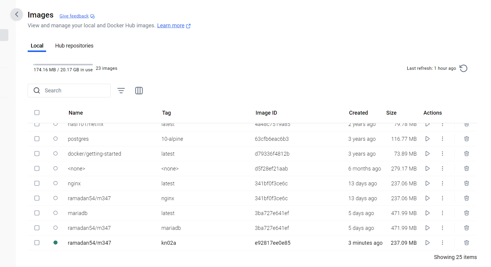
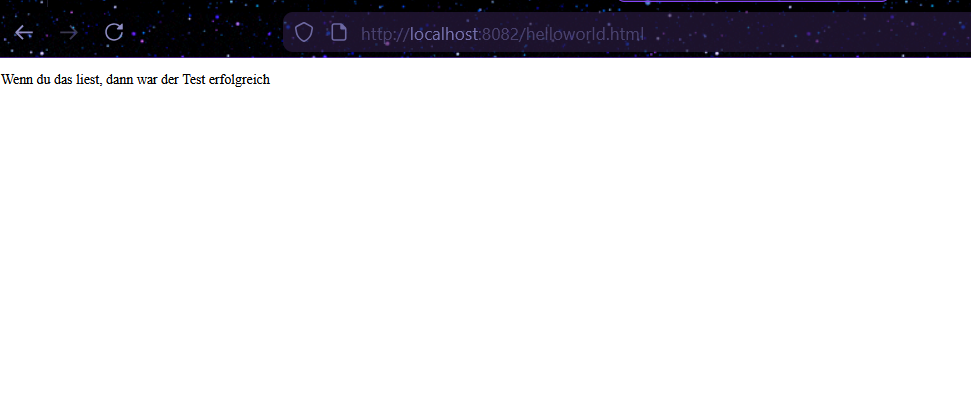
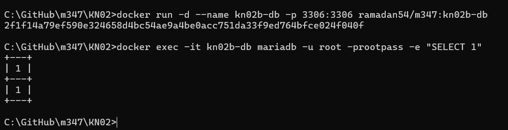
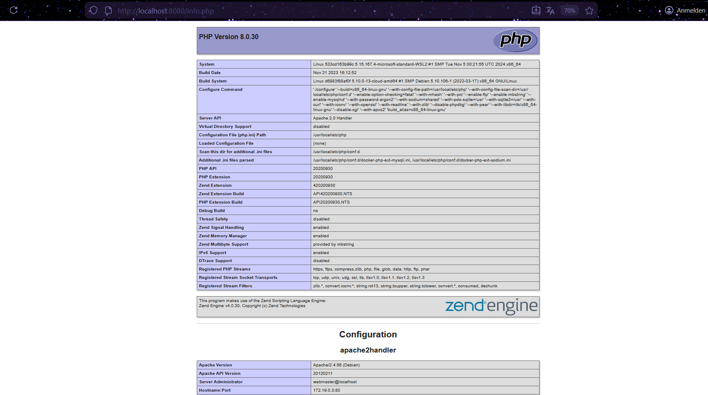
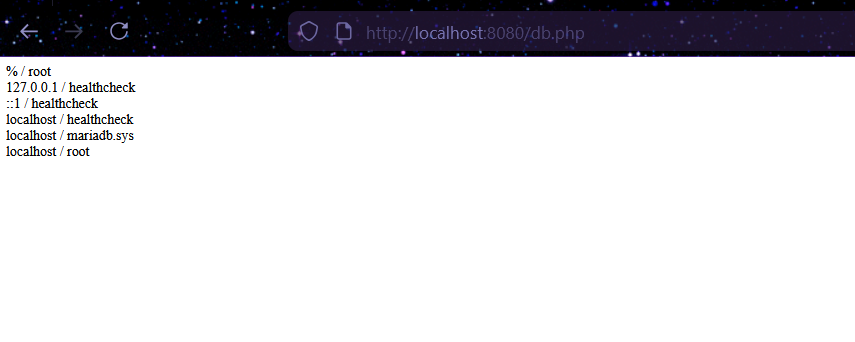

# KN02: Dockerfile

---

## A) Dockerfile I

### Dokumentiertes Dockerfile (Original)

```dockerfile
FROM nginx              # Verwendet das offizielle nginx-Image als Basis-Image
COPY static-html-directory /var/www/html  # Kopiert den lokalen Ordner "static-html-directory" in den Container nach /var/www/html
EXPOSE 80               # Gibt an, dass der Container den Port 80 nach aussen freigeben soll
```

### Angepasstes Dockerfile

```dockerfile
FROM nginx
WORKDIR /usr/share/nginx/html
COPY helloworld.html .
EXPOSE 80
```

| Zeile                           | Erklärung                                                                                                                                                      |
| ------------------------------- | -------------------------------------------------------------------------------------------------------------------------------------------------------------- |
| `FROM nginx`                    | Verwendet das offizielle nginx-Image als Basis. Darauf wird unser eigenes Image aufgebaut.                                                                     |
| `WORKDIR /usr/share/nginx/html` | Setzt das Arbeitsverzeichnis im Container. Das ist der Ordner, in dem nginx die HTML-Dateien erwartet. Alle folgenden Befehle beziehen sich auf diesen Ordner. |
| `COPY helloworld.html .`        | Kopiert die lokale Datei `helloworld.html` in das Arbeitsverzeichnis im Container (`.` = aktuelles WORKDIR).                                                   |
| `EXPOSE 80`                     | Gibt an, dass der Container auf Port 80 lauscht. So weiss Docker, welchen Port man mappen soll.                                                                |

### Docker-Befehle für das Build

```bash
cd C:\GitHub\m347\KN02
docker build -t ramadan54/m347:kn02a .
```

Der Befehl `docker build` erstellt ein neues Image aus dem Dockerfile. `-t ramadan54/m347:kn02a` gibt dem Image einen Namen und Tag. Der Punkt `.` am Ende sagt Docker, dass das Dockerfile im aktuellen Verzeichnis liegt.

### Container starten und Image pushen

```bash
docker run -d --name kn02a -p 8082:80 ramadan54/m347:kn02a
docker push ramadan54/m347:kn02a
```

### Screenshot des Images in Docker Desktop



### Screenshot der helloworld.html Seite



---

## B) Dockerfile II

### Übersicht

Für Teil B wurden zwei Container erstellt:

- **kn02b-db**: MariaDB Datenbank-Container
- **kn02b-web**: PHP/Apache Webserver-Container

Die beiden Container kommunizieren über ein Docker-Netzwerk miteinander.

---

### Datenbank (MariaDB)

#### Dockerfile (db/Dockerfile)

```dockerfile
FROM mariadb
ENV MYSQL_ROOT_PASSWORD=rootpass
ENV MYSQL_DATABASE=mysql
EXPOSE 3306
```

| Zeile                              | Erklärung                                                                            |
| ---------------------------------- | ------------------------------------------------------------------------------------ |
| `FROM mariadb`                     | Verwendet das offizielle MariaDB-Image als Basis.                                    |
| `ENV MYSQL_ROOT_PASSWORD=rootpass` | Setzt eine Umgebungsvariable, die das Root-Passwort für die Datenbank definiert.     |
| `ENV MYSQL_DATABASE=mysql`         | Setzt eine Umgebungsvariable, die den Namen der Standard-Datenbank definiert.        |
| `EXPOSE 3306`                      | Gibt an, dass der Container auf Port 3306 lauscht (Standard-Port für MariaDB/MySQL). |

#### Docker-Befehle für Build und Start

```bash
docker build -t ramadan54/m347:kn02b-db ./db
docker run -d --name kn02b-db -p 3306:3306 ramadan54/m347:kn02b-db
```

#### Screenshot: Zugriff auf den DB-Server



---

### Webseite (PHP/Apache)

#### Dockerfile (web/Dockerfile)

```dockerfile
FROM php:8.0-apache
RUN docker-php-ext-install mysqli
WORKDIR /var/www/html
COPY info.php .
COPY db.php .
EXPOSE 80
```

| Zeile                               | Erklärung                                                                                                                                        |
| ----------------------------------- | ------------------------------------------------------------------------------------------------------------------------------------------------ |
| `FROM php:8.0-apache`               | Verwendet das offizielle PHP-Image mit Apache-Webserver in Version 8.0.                                                                          |
| `RUN docker-php-ext-install mysqli` | Führt einen Befehl während des Builds aus: Installiert die PHP-Erweiterung `mysqli`, die für die Verbindung zur MariaDB-Datenbank benötigt wird. |
| `WORKDIR /var/www/html`             | Setzt das Arbeitsverzeichnis auf den Standard-Ordner von Apache für Webdateien.                                                                  |
| `COPY info.php .`                   | Kopiert die Datei `info.php` in das Arbeitsverzeichnis.                                                                                          |
| `COPY db.php .`                     | Kopiert die Datei `db.php` in das Arbeitsverzeichnis.                                                                                            |
| `EXPOSE 80`                         | Gibt an, dass der Container auf Port 80 lauscht (Standard-Port für HTTP).                                                                        |

#### Docker-Befehle für Build und Start

```bash
docker build -t ramadan54/m347:kn02b-web ./web

# Netzwerk erstellen, damit die Container kommunizieren können
docker network create kn02b-network
docker network connect kn02b-network kn02b-db

# Web-Container starten und mit dem Netzwerk verbinden
docker run -d --name kn02b-web -p 8080:80 --network kn02b-network ramadan54/m347:kn02b-web
```

**Erklärung Networking:** Damit der Web-Container auf den DB-Container zugreifen kann, müssen beide im gleichen Docker-Netzwerk sein. Mit `docker network create` wird ein Netzwerk erstellt. Innerhalb dieses Netzwerks können Container sich über ihren Namen ansprechen. Deshalb steht in `db.php` als Servername `kn02b-db` – das ist der Name des Datenbank-Containers.

#### Push in das private Repository

```bash
docker push ramadan54/m347:kn02b-db
docker push ramadan54/m347:kn02b-web
```

#### Screenshot: info.php



#### Screenshot: db.php



#### Angepasste PHP-Dateien

**info.php:**

```php
<?php

// Show all information, defaults to INFO_ALL
phpinfo();

?>
```

**db.php:**

```php
<?php
        //database
        $servername = "kn02b-db";
        $username = "root";
        $password = "rootpass";
        $dbname = "mysql";

        // Create connection
        $conn = new mysqli($servername, $username, $password, $dbname);
        // Check connection
        if ($conn->connect_error) {
                die("Connection failed: " . $conn->connect_error);
        }

        $sql = "select Host, User from mysql.user;";
        $result = $conn->query($sql);
        while($row = $result->fetch_assoc()){
                echo($row["Host"] . " / " . $row["User"] . "<br />");
        }
        //var_dump($result);
?>
```

In `db.php` wurde `$servername` auf `"kn02b-db"` geändert. Das ist der Container-Name der Datenbank, der im Docker-Netzwerk als Hostname verwendet wird. Ausserdem wurden `$username`, `$password` und `$dbname` an die im Dockerfile definierten Werte angepasst.
