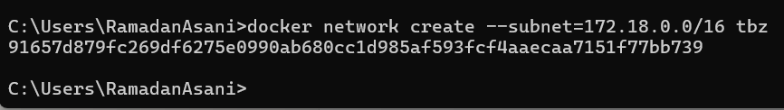
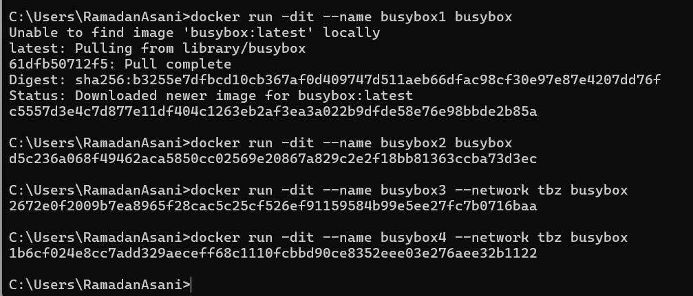
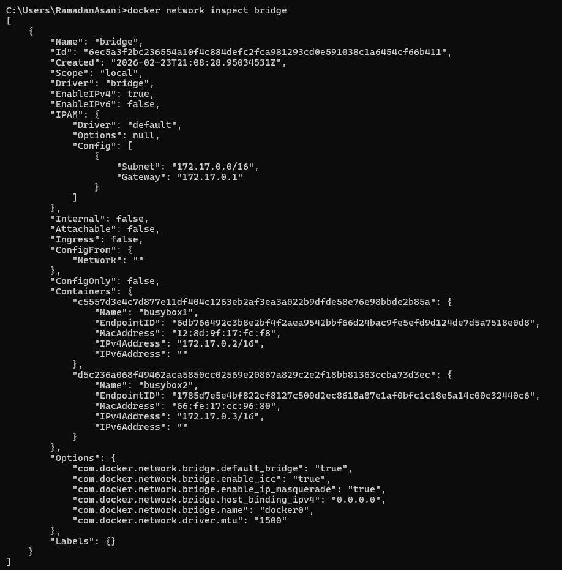
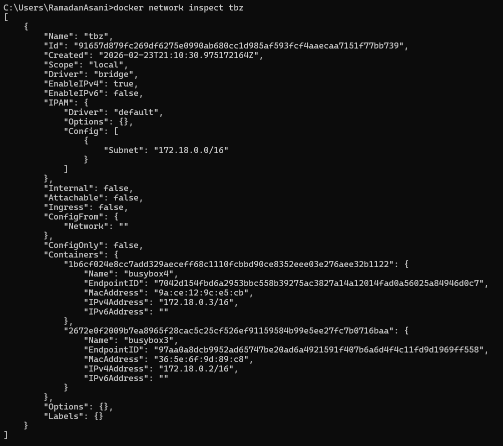
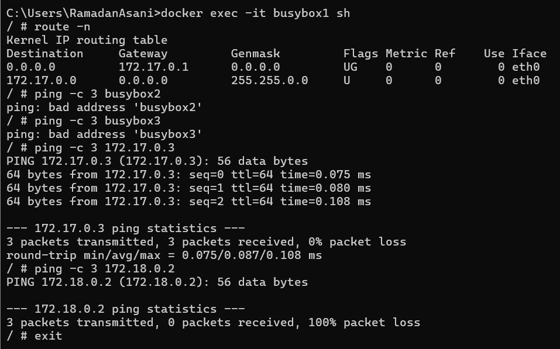
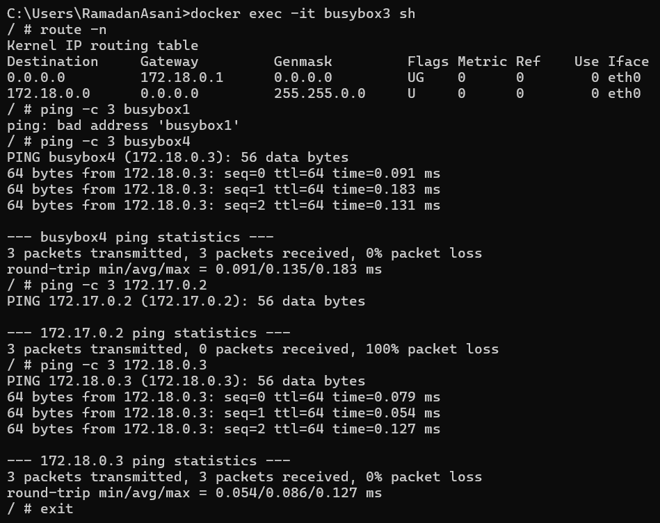

# KN03: Netzwerk, Sicherheit

---

## A) Eigenes Netzwerk

### Übersicht

Das Zielsystem besteht aus vier Containern basierend auf dem `busybox`-Image, aufgeteilt auf zwei Netzwerke:

- **busybox1** und **busybox2** → im **default bridge** Netzwerk (172.17.0.0/16)
- **busybox3** und **busybox4** → im **user-defined Netzwerk** `tbz` (172.18.0.0/16)

---

### Netzwerk erstellen
```bash
docker network create --subnet=172.18.0.0/16 tbz
```



---

### Container starten
```bash
docker run -dit --name busybox1 busybox
docker run -dit --name busybox2 busybox
docker run -dit --name busybox3 --network tbz busybox
docker run -dit --name busybox4 --network tbz busybox
```



---

### 1. IP-Adressen der Container

Die IP-Adressen wurden mit `docker network inspect` ermittelt:
```bash
docker network inspect bridge
docker network inspect tbz
```




| Container | Netzwerk | IP-Adresse |
|-----------|----------|------------|
| busybox1 | bridge (default) | 172.17.0.2 |
| busybox2 | bridge (default) | 172.17.0.3 |
| busybox3 | tbz | 172.18.0.2 |
| busybox4 | tbz | 172.18.0.3 |

---

### 2. Interaktive Session auf busybox1
```bash
docker exec -it busybox1 sh
```

Folgende Befehle wurden ausgeführt:
```bash
route -n
ping -c 3 busybox2
ping -c 3 busybox3
ping -c 3 172.17.0.3
ping -c 3 172.18.0.2
```



**Resultate:**

| Befehl | Ergebnis | Erklärung |
|--------|----------|-----------|
| `route -n` | Gateway: 172.17.0.1 | Default-Gateway des bridge Netzwerks |
| `ping busybox2` | ❌ bad address | Das default bridge Netzwerk hat kein DNS – Container-Namen werden nicht aufgelöst |
| `ping busybox3` | ❌ bad address | Anderes Netzwerk, kein DNS, Name nicht erreichbar |
| `ping 172.17.0.3` | ✅ 0% packet loss | Gleisches Netzwerk, IP-Kommunikation funktioniert |
| `ping 172.18.0.2` | ❌ 100% packet loss | Anderes Netzwerk, keine Route vorhanden |

**Default-Gateway von busybox1:** `172.17.0.1` – den gleichen Gateway hat **busybox2**, da beide im selben default bridge Netzwerk sind.

---

### 3. Interaktive Session auf busybox3
```bash
docker exec -it busybox3 sh
```

Folgende Befehle wurden ausgeführt:
```bash
route -n
ping -c 3 busybox1
ping -c 3 busybox4
ping -c 3 172.17.0.2
ping -c 3 172.18.0.3
```



**Resultate:**

| Befehl | Ergebnis | Erklärung |
|--------|----------|-----------|
| `route -n` | Gateway: 172.18.0.1 | Default-Gateway des tbz Netzwerks |
| `ping busybox1` | ❌ bad address | busybox1 ist in einem anderen Netzwerk, kein DNS-Eintrag vorhanden |
| `ping busybox4` | ✅ 0% packet loss | Gleisches user-defined Netzwerk – DNS funktioniert, Name wird aufgelöst |
| `ping 172.17.0.2` | ❌ 100% packet loss | Anderes Netzwerk, keine Route vorhanden |
| `ping 172.18.0.3` | ✅ 0% packet loss | Gleisches Netzwerk, IP-Kommunikation funktioniert |

**Default-Gateway von busybox3:** `172.18.0.1` – den gleichen Gateway hat **busybox4**, da beide im tbz Netzwerk sind.

---

### Gemeinsamkeiten und Unterschiede

**Gemeinsamkeiten:**
- Container im gleichen Netzwerk können sich gegenseitig per IP erreichen, egal ob default bridge oder user-defined.
- Container in verschiedenen Netzwerken können sich nicht erreichen – weder per Name noch per IP.

**Unterschiede:**

| Eigenschaft | default bridge | user-defined (tbz) |
|-------------|---------------|---------------------|
| DNS / Namensauflösung | ❌ Nicht vorhanden | ✅ Vorhanden |
| Ping per Name | ❌ Funktioniert nicht | ✅ Funktioniert |
| Ping per IP | ✅ Funktioniert | ✅ Funktioniert |
| IP-Bereich | 172.17.0.0/16 | 172.18.0.0/16 |

**Schlussfolgerung:** Der wichtigste Unterschied ist die **DNS-Auflösung**. Im default bridge Netzwerk können Container sich nur per IP-Adresse ansprechen. Im user-defined Netzwerk (`tbz`) können Container sich auch per **Container-Name** ansprechen, weil Docker dort automatisch einen internen DNS-Server betreibt. Das macht user-defined Netzwerke deutlich flexibler und sicherer für Multi-Container-Anwendungen.

---

### Betrachtung KN02

**In welchem Netzwerk befanden sich die beiden Container?**

In KN02 wurde mit dem Befehl `docker network create kn02b-network` ein **user-defined bridge Netzwerk** erstellt. Beide Container (`kn02b-db` und `kn02b-web`) wurden mit `--network kn02b-network` in dieses Netzwerk eingebunden.

**Wieso konnten die miteinander reden?**

Da es sich um ein user-defined Netzwerk handelt, verfügt es über einen internen DNS-Server. Deshalb konnte der Web-Container den Datenbank-Container direkt über seinen Namen `kn02b-db` als Hostname in der `db.php` ansprechen – ohne IP-Adresse zu kennen. Hätte man das default bridge Netzwerk verwendet, wäre dies nicht möglich gewesen.