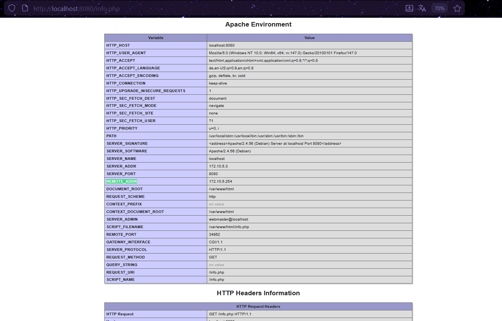
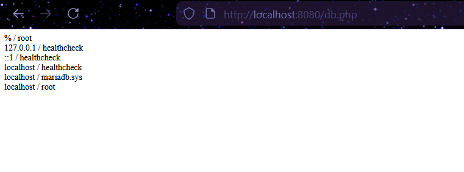
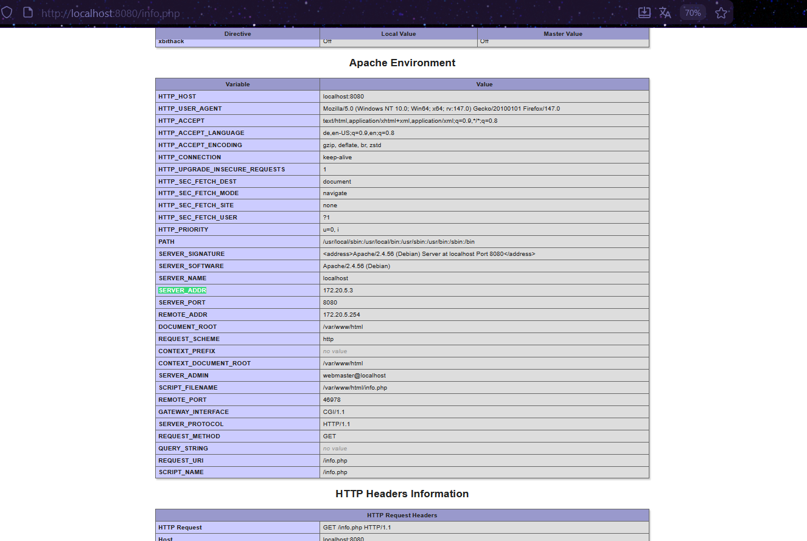
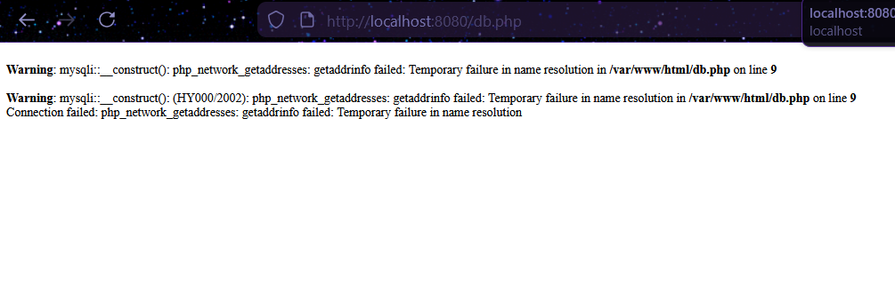
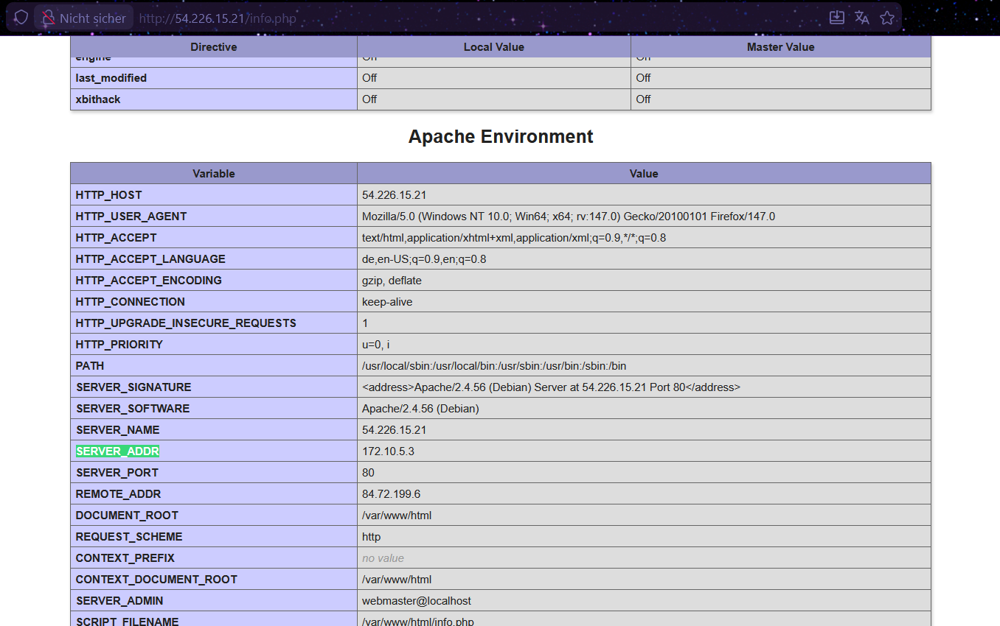
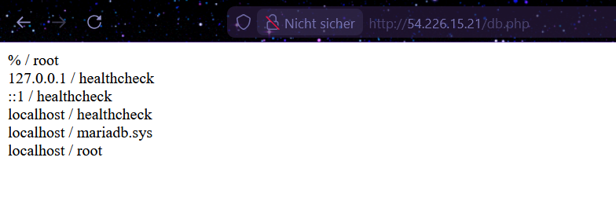

# KN04: Docker Compose

---

## A) Docker Compose: Lokal

### Teil a) Verwendung von Original Images

#### Übersicht

In diesem Teil wurde eine Docker Compose Umgebung erstellt, die zwei Container startet:

- **m347-kn04a-db**: MariaDB Datenbank-Container (direkt über Image)
- **m347-kn04a-web**: PHP/Apache Webserver-Container (über Dockerfile)

#### Ordnerstruktur

```
KN04/
├── docker-compose.yml
├── web/
│   ├── Dockerfile
│   ├── info.php
│   └── db.php
```

#### docker-compose.yml

```yaml
services:
  m347-kn04a-db:
    image: mariadb:latest
    container_name: m347-kn04a-db
    environment:
      MYSQL_ROOT_PASSWORD: rootpass
      MYSQL_DATABASE: mysql
    networks:
      kn04a-network:
        ipv4_address: 172.10.5.2

  m347-kn04a-web:
    build: ./web
    container_name: m347-kn04a-web
    ports:
      - "8080:80"
    depends_on:
      - m347-kn04a-db
    networks:
      kn04a-network:
        ipv4_address: 172.10.5.3

networks:
  kn04a-network:
    driver: bridge
    ipam:
      config:
        - subnet: 172.10.0.0/16
          ip_range: 172.10.5.0/24
          gateway: 172.10.5.254
```

#### Dockerfile (web/Dockerfile)

```dockerfile
FROM php:8.0-apache
RUN docker-php-ext-install mysqli
WORKDIR /var/www/html
COPY info.php .
COPY db.php .
EXPOSE 80
```

#### Was macht `docker compose up`?

`docker compose up` ist eine Zusammenfassung folgender Befehle:

| Befehl                  | Erklärung                                                                           |
| ----------------------- | ----------------------------------------------------------------------------------- |
| `docker network create` | Erstellt das definierte Netzwerk (`kn04a-network`)                                  |
| `docker build`          | Baut das Image aus dem Dockerfile für den Web-Container                             |
| `docker pull`           | Lädt das mariadb:latest Image von Docker Hub herunter                               |
| `docker create`         | Erstellt die Container aus den Images                                               |
| `docker start`          | Startet alle Container in der richtigen Reihenfolge (db zuerst, wegen `depends_on`) |

#### Screenshot: info.php (SERVER_ADDR und REMOTE_ADDR sichtbar)



#### Screenshot: db.php



---

### Teil b) Verwendung eigener Images

#### Übersicht

In diesem Teil wurden die eigenen Images von Docker Hub verwendet (`ramadan54/m347:kn02b-web` und `ramadan54/m347:kn02b-db`). Es wird kein Dockerfile mehr benötigt.

#### docker-compose.yml

```yaml
services:
  m347-kn04b-db:
    image: ramadan54/m347:kn02b-db
    container_name: m347-kn04b-db
    networks:
      kn04b-network:
        ipv4_address: 172.20.5.2

  m347-kn04b-web:
    image: ramadan54/m347:kn02b-web
    container_name: m347-kn04b-web
    ports:
      - "8080:80"
    depends_on:
      - m347-kn04b-db
    networks:
      kn04b-network:
        ipv4_address: 172.20.5.3

networks:
  kn04b-network:
    driver: bridge
    ipam:
      config:
        - subnet: 172.20.0.0/16
          ip_range: 172.20.5.0/24
          gateway: 172.20.5.254
```

#### Screenshot: info.php



#### Screenshot: db.php (Fehler)



#### Erklärung des Fehlers

Der Fehler `php_network_getaddresses: getaddrinfo failed` tritt auf, weil in der `db.php` des publizierten Images noch der alte Servername `kn02b-db` aus KN02 eingetragen ist. Der neue DB-Container heisst aber `m347-kn04b-db`. Da der Name nicht übereinstimmt, kann der Web-Container die Datenbank nicht finden.

**Lösung:** Die `db.php` müsste mit dem neuen Servernamen `m347-kn04b-db` angepasst, ein neues Image gebaut und auf Docker Hub gepusht werden.

---

## B) Docker Compose: Cloud

### Übersicht

Die Umgebung aus Teil A a) wurde in der AWS Cloud mit einer EC2-Instance aufgebaut. Cloud-Init wurde verwendet, um Docker zu installieren, alle notwendigen Dateien zu erstellen und die Container automatisch zu starten.

### Cloud-Init Datei

```yaml
#cloud-config
users:
  - name: ubuntu
    sudo: ALL=(ALL) NOPASSWD:ALL
    groups: users, admin
    home: /home/ubuntu
    shell: /bin/bash
    ssh_authorized_keys:
      - ssh-rsa AAAAB3NzaC1yc2EAAAADAQABAAABAQCUBo+qnNu5xxM9vfz4C04M36FHxHNrEMdm5TkFj1/SfVtqunlUOeMpu7nFCZZKnX8HYwf/MkjcBiTYAgncxku8grwl6XuW/pcvmb6/ghSIaw4xtRRSzit7omqJ5d8kXB3+Nd1aaMHsjfly4nkaqswhySVXQqr8Hw6DbWVw8jLLVKEE+5NZHY33hJkhJwK4blCllsGpmQaKi1qxjsN0hZOWNK01iJAydwD8t2xJ0NOYbq8Qas5IyPnRN7SPxvEhIP6WLQ6Ym6Dmf8FwNW1cHLTKabgjzt5f/HKUkKS89dPd3fn4nnFli1BOMECGUIvVlOw2pQNri7+04OOfn2FGlqr5 teacher
      - ssh-ed25519 AAAAC3NzaC1lZDI1NTE5AAAAIJlL2tX6fQAHzvRoPJYVRokzUBL2ukIYnH8J/sxqN0NR azuread\ramadanasani@RSRGCH000294
ssh_pwauth: false
disable_root: false
package_update: true
package_upgrade: true
groups:
  - docker
system_info:
  default_user:
    groups: [docker]
packages:
  - apt-transport-https
  - ca-certificates
  - curl
  - gnupg
  - lsb-release
  - unattended-upgrades
final_message: "The system is finally up, after $UPTIME seconds"
write_files:
  - path: /home/ubuntu/app/docker-compose.yml
    content: |
      services:
        m347-kn04c-db:
          image: mariadb:latest
          container_name: m347-kn04c-db
          environment:
            MYSQL_ROOT_PASSWORD: rootpass
            MYSQL_DATABASE: mysql
          networks:
            kn04c-network:
              ipv4_address: 172.10.5.2
        m347-kn04c-web:
          build: ./web
          container_name: m347-kn04c-web
          ports:
            - "80:80"
          depends_on:
            - m347-kn04c-db
          networks:
            kn04c-network:
              ipv4_address: 172.10.5.3
      networks:
        kn04c-network:
          driver: bridge
          ipam:
            config:
              - subnet: 172.10.0.0/16
                ip_range: 172.10.5.0/24
                gateway: 172.10.5.254
  - path: /home/ubuntu/app/web/Dockerfile
    content: |
      FROM php:8.0-apache
      RUN docker-php-ext-install mysqli
      WORKDIR /var/www/html
      COPY info.php .
      COPY db.php .
      EXPOSE 80
  - path: /home/ubuntu/app/web/info.php
    content: |
      <?php
      phpinfo();
      ?>
  - path: /home/ubuntu/app/web/db.php
    content: |
      <?php
              $servername = "m347-kn04c-db";
              $username = "root";
              $password = "rootpass";
              $dbname = "mysql";
              $conn = new mysqli($servername, $username, $password, $dbname);
              if ($conn->connect_error) {
                      die("Connection failed: " . $conn->connect_error);
              }
              $sql = "select Host, User from mysql.user;";
              $result = $conn->query($sql);
              while($row = $result->fetch_assoc()){
                      echo($row["Host"] . " / " . $row["User"] . "<br />");
              }
      ?>
runcmd:
  - mkdir -p /etc/apt/keyrings
  - curl -fsSL https://download.docker.com/linux/ubuntu/gpg | gpg --dearmor -o /etc/apt/keyrings/docker.gpg
  - echo "deb [arch=$(dpkg --print-architecture) signed-by=/etc/apt/keyrings/docker.gpg] https://download.docker.com/linux/ubuntu $(lsb_release -cs) stable" | tee /etc/apt/sources.list.d/docker.list > /dev/null
  - apt-get update
  - apt-get install -y docker-ce docker-ce-cli containerd.io docker-compose-plugin
  - systemctl enable docker
  - systemctl start docker
  - cd /home/ubuntu/app && docker compose up -d
```

### Screenshot: info.php in der Cloud (SERVER_ADDR und REMOTE_ADDR sichtbar)



### Screenshot: db.php in der Cloud


