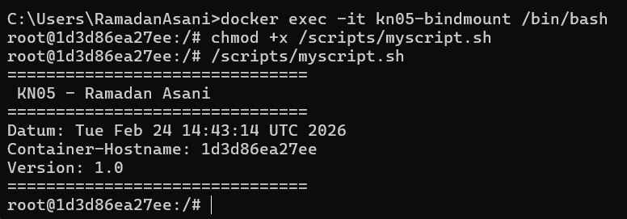
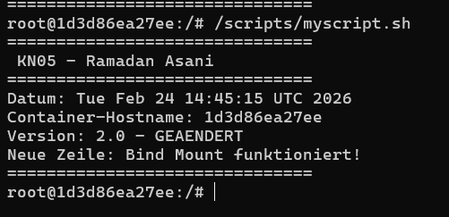
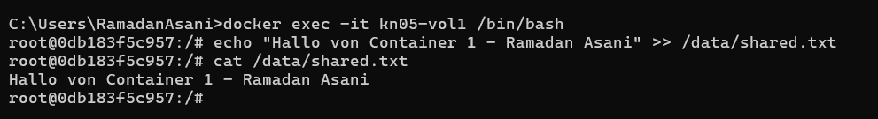
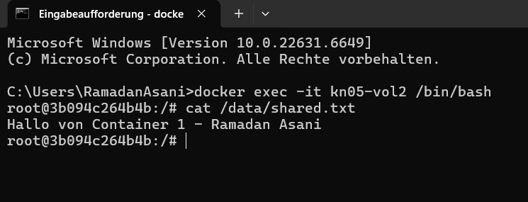
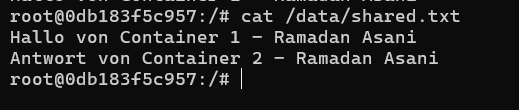
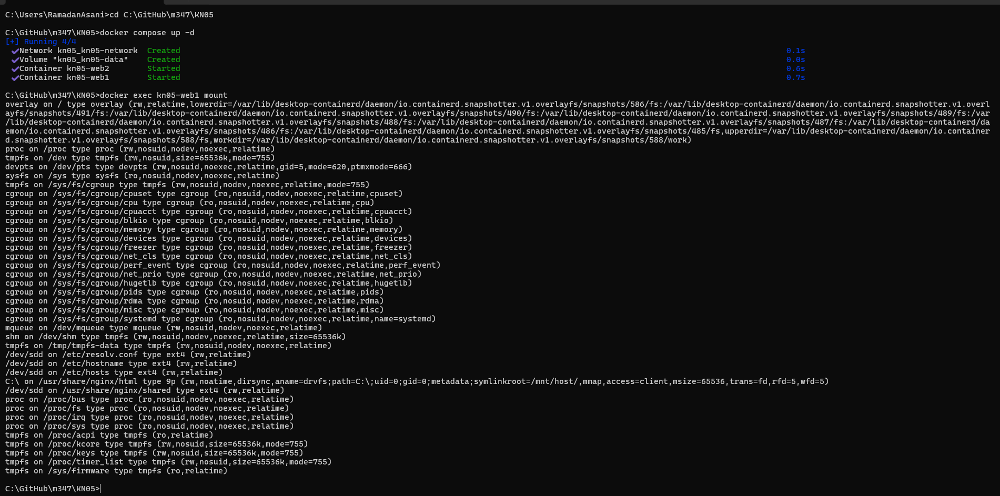
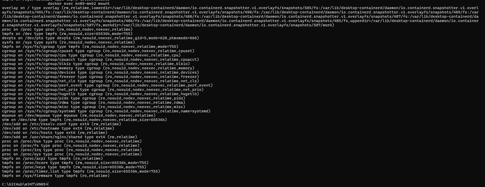

# KN05: Arbeit mit Speicher

---

## A) Bind Mounts (40%)

### Konzept

Ein Bind Mount verbindet ein Verzeichnis auf dem **Host-System** direkt mit einem Pfad im Container. Änderungen auf dem Host sind sofort im Container sichtbar – ohne den Container neu zu starten. Das ist ideal für die Entwicklung, wenn man Code-Änderungen testen will.

### Befehle
```bash
# Container mit Bind Mount starten
docker run -d --name kn05-bindmount -v C:\GitHub\m347\KN05\scripts:/scripts nginx

# In den Container einloggen
docker exec -it kn05-bindmount /bin/bash

# Skript ausführbar machen und starten
chmod +x /scripts/myscript.sh
/scripts/myscript.sh

# Container stoppen und entfernen
docker stop kn05-bindmount
docker rm kn05-bindmount
```

### Skript Version 1.0 (myscript.sh)
```bash
#!/bin/bash
echo "==============================="
echo " KN05 - Ramadan Asani"
echo "==============================="
echo "Datum: $(date)"
echo "Container-Hostname: $(hostname)"
echo "Version: 1.0"
echo "==============================="
```

### Skript Version 2.0 (auf Host geändert, kein Container-Neustart)
```bash
#!/bin/bash
echo "==============================="
echo " KN05 - Ramadan Asani"
echo "==============================="
echo "Datum: $(date)"
echo "Container-Hostname: $(hostname)"
echo "Version: 2.0 - GEAENDERT"
echo "Neue Zeile: Bind Mount funktioniert!"
echo "==============================="
```

### Screenshot: Skript Version 1.0



### Screenshot: Skript Version 2.0 (nach Änderung auf Host)



### Erklärung

Der Container wurde **nicht neu gestartet**. Trotzdem war die Änderung sofort sichtbar, weil der Ordner `C:\GitHub\m347\KN05\scripts` direkt in den Container unter `/scripts` eingebunden ist. Was auf dem Host geändert wird, sieht der Container sofort.

---

## B) Volumes (30%)

### Konzept

Named Volumes werden von Docker verwaltet. Mehrere Container können dasselbe Volume einbinden und so Daten miteinander teilen. Was ein Container schreibt, kann der andere sofort lesen.

### Befehle
```bash
# Named Volume erstellen
docker volume create kn05-shared

# Zwei Container mit demselben Volume starten
docker run -d --name kn05-vol1 -v kn05-shared:/data nginx
docker run -d --name kn05-vol2 -v kn05-shared:/data nginx

# In Container 1 einloggen und schreiben
docker exec -it kn05-vol1 /bin/bash
echo "Hallo von Container 1 - Ramadan Asani" >> /data/shared.txt
cat /data/shared.txt

# In Container 2 einloggen und lesen
docker exec -it kn05-vol2 /bin/bash
cat /data/shared.txt

# In Container 2 schreiben
echo "Antwort von Container 2 - Ramadan Asani" >> /data/shared.txt
cat /data/shared.txt

# Zurück in Container 1 lesen
cat /data/shared.txt

# Aufräumen
docker stop kn05-vol1 kn05-vol2
docker rm kn05-vol1 kn05-vol2
docker volume rm kn05-shared
```

### Screenshot: Container 1 schreibt in die Datei



### Screenshot: Container 2 liest die Datei von Container 1



### Screenshot: Container 1 liest die Antwort von Container 2



### Erklärung

Beide Container teilen sich das gleiche Named Volume `kn05-shared` unter dem Pfad `/data`. Was Container 1 schreibt, kann Container 2 sofort lesen – und umgekehrt. Das Volume existiert unabhängig von den Containern und bleibt auch nach dem Stoppen erhalten.

---

## C) Speicher mit Docker Compose (30%)

### Konzept

Docker Compose ermöglicht es, alle drei Speichertypen in einer einzigen YAML-Datei zu definieren:

- **Named Volume** – persistenter, von Docker verwalteter Speicher
- **Bind Mount** – Host-Verzeichnis direkt im Container
- **tmpfs** – nur im RAM gespeichert, nach Container-Stopp weg

### docker-compose.yml
```yaml
services:
  kn05-web1:
    image: nginx:latest
    container_name: kn05-web1
    ports:
      - "8081:80"
    volumes:
      - type: volume
        source: kn05-data
        target: /usr/share/nginx/shared
      - type: bind
        source: ./html
        target: /usr/share/nginx/html
      - type: tmpfs
        target: /tmp/tmpfs-data
    networks:
      - kn05-network

  kn05-web2:
    image: nginx:latest
    container_name: kn05-web2
    ports:
      - "8082:80"
    volumes:
      - kn05-data:/usr/share/nginx/shared
    networks:
      - kn05-network

volumes:
  kn05-data:
    driver: local

networks:
  kn05-network:
    driver: bridge
```

### Befehle
```bash
# Container starten
docker compose up -d

# mount in Container 1 prüfen (alle 3 Speichertypen)
docker exec kn05-web1 mount

# mount in Container 2 prüfen (Named Volume)
docker exec kn05-web2 mount

# Aufräumen
docker compose down -v
```

### Screenshot: mount Befehl Container 1 (kn05-web1)

Zeigt alle drei Speichertypen:
- `tmpfs on /tmp/tmpfs-data type tmpfs` → **tmpfs Mount**
- `C:\ on /usr/share/nginx/html type 9p` → **Bind Mount**
- `/dev/sdd on /usr/share/nginx/shared type ext4` → **Named Volume**



### Screenshot: mount Befehl Container 2 (kn05-web2)

Zeigt das Named Volume:
- `/dev/sdd on /usr/share/nginx/shared type ext4` → **Named Volume**



### Erklärung der Syntax

| Volume | Syntax | Container |
|---|---|---|
| Named Volume | Long Syntax (`type: volume`) | kn05-web1 |
| Bind Mount | Long Syntax (`type: bind`) | kn05-web1 |
| tmpfs | Long Syntax (`type: tmpfs`) | kn05-web1 |
| Named Volume | Short Syntax (`kn05-data:/...`) | kn05-web2 |

Das **Top-Level Element** `volumes: kn05-data:` deklariert das Named Volume, damit es von beiden Containern verwendet werden kann.