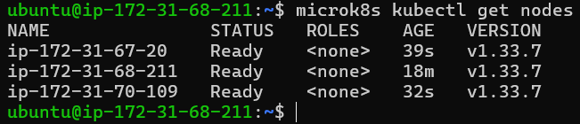
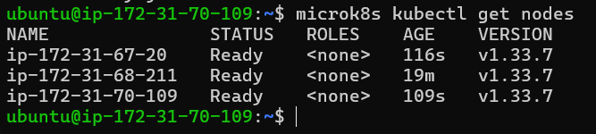
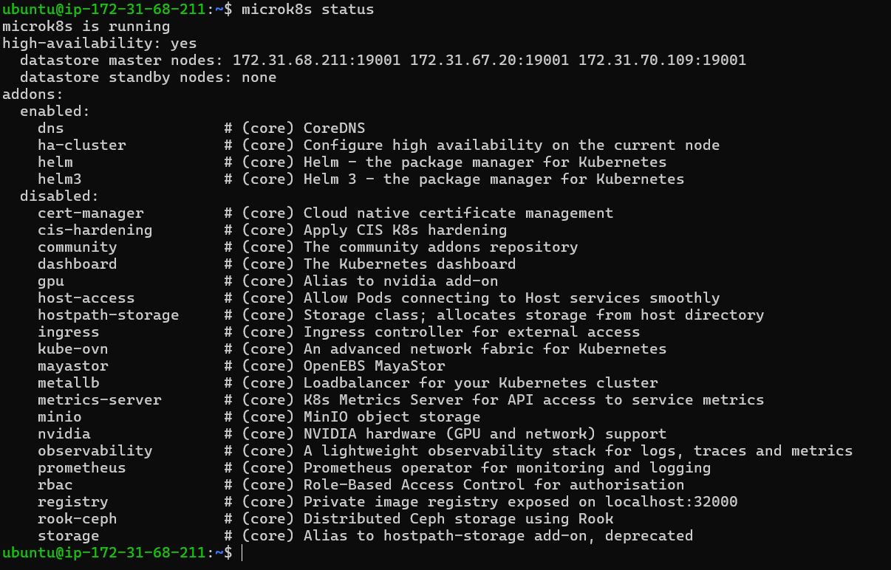
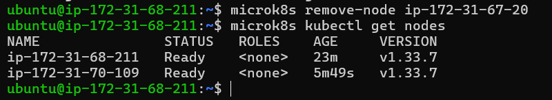
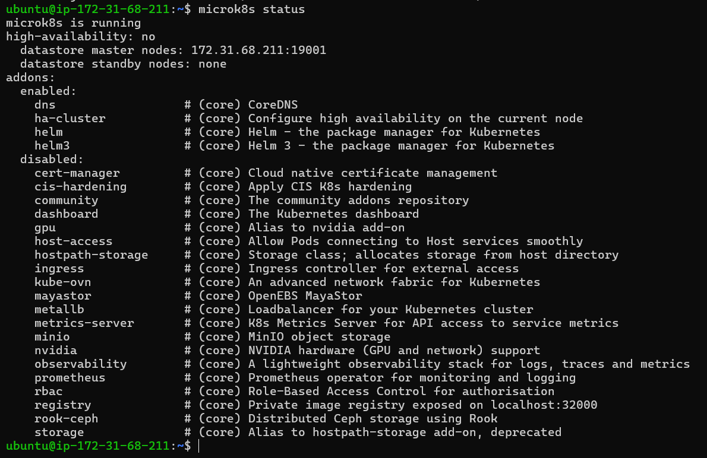
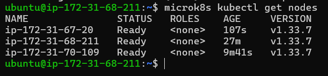
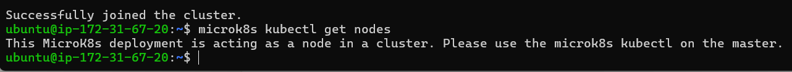

# KN06: Kubernetes I

---

## A) Installation (50%)

### Übersicht

Für diesen Auftrag wurden drei EC2-Instanzen auf AWS erstellt (Ubuntu 22.04, t3.medium) und zu einem MicroK8s-Cluster verbunden.

| Node | Hostname | Private IP |
|---|---|---|
| node1 (Master) | ip-172-31-68-211 | 172.31.68.211 |
| node2 (Master) | ip-172-31-70-109 | 172.31.70.109 |
| node3 (Worker) | ip-172-31-67-20 | 172.31.67.20 |

### MicroK8s Installation (auf allen drei Nodes)
```bash
sudo snap install microk8s --classic
sudo usermod -a -G microk8s ubuntu
sudo chown -f -R ubuntu ~/.kube
newgrp microk8s
microk8s status --wait-ready
```

| Befehl | Erklärung |
|---|---|
| `sudo snap install microk8s --classic` | Installiert MicroK8s über den Snap-Paketmanager. `--classic` erlaubt dem Paket vollen Zugriff auf das System, was für MicroK8s notwendig ist |
| `sudo usermod -a -G microk8s ubuntu` | Fügt den Benutzer `ubuntu` der Gruppe `microk8s` hinzu, damit er MicroK8s-Befehle ohne `sudo` ausführen kann |
| `sudo chown -f -R ubuntu ~/.kube` | Setzt den Besitzer des `.kube`-Verzeichnisses auf den Benutzer `ubuntu`, damit dieser auf die Kubernetes-Konfigurationsdateien zugreifen kann |
| `newgrp microk8s` | Wechselt die aktive Gruppe auf `microk8s`, damit die Gruppenänderung ohne Neuanmeldung wirksam wird |
| `microk8s status --wait-ready` | Zeigt den Status von MicroK8s an und wartet, bis der Node vollständig bereit ist |

### Nodes dem Cluster hinzufügen
```bash
# Auf node1 – Token generieren
microk8s add-node

# Auf node2 – dem Cluster beitreten
microk8s join 172.31.68.211:25000/<token>

# Auf node3 – dem Cluster beitreten
microk8s join 172.31.68.211:25000/<token>
```

| Befehl | Erklärung |
|---|---|
| `microk8s add-node` | Generiert auf dem Master-Node ein einmaliges Join-Token. Dieses Token wird benötigt, damit ein anderer Node dem Cluster beitreten kann |
| `microk8s join <adresse>:<port>/<token>` | Verbindet den aktuellen Node mit dem Cluster. Die Adresse ist die private IP des Master-Nodes, der Port 25000 ist der Standard-Port für MicroK8s-Cluster-Kommunikation |

### Alle drei Nodes im Cluster
```bash
microk8s kubectl get nodes
```

| Befehl | Erklärung |
|---|---|
| `microk8s kubectl get nodes` | Zeigt alle Nodes im Kubernetes-Cluster an, inklusive ihrem Status (Ready/NotReady), ihrer Rolle und der Kubernetes-Version |

**Screenshot: Alle drei Nodes Ready auf node1:**



---

## B) Verständnis für Cluster (50%)

### 1. `microk8s kubectl get nodes` auf node2

Derselbe Befehl wurde auf node2 ausgeführt. Das Resultat ist identisch – alle drei Nodes sind sichtbar, da jeder Master-Node den vollständigen Cluster-Zustand kennt.
```bash
microk8s kubectl get nodes
```

**Screenshot: get nodes auf node2:**



---

### 2. `microk8s status` – High Availability Erklärung
```bash
microk8s status
```

**Screenshot: microk8s status (vor Worker-Konfiguration):**



**Erklärung:**

Die ersten Zeilen von `microk8s status` zeigen den Zustand des Clusters:

- `high-availability: yes` – Der Cluster ist im Hochverfügbarkeitsmodus, weil alle drei Nodes als `datastore master nodes` aktiv sind. Das bedeutet: fällt ein Node aus, übernehmen die anderen beiden – der Cluster bleibt verfügbar.
- `datastore master nodes: 172.31.68.211:19001 172.31.67.20:19001 172.31.70.109:19001` – Alle drei Nodes speichern die Cluster-Daten gemeinsam in einer verteilten dqlite-Datenbank. Mindestens 3 Master-Nodes werden für HA benötigt.
- `datastore standby nodes: none` – Es gibt keine zusätzlichen Standby-Nodes.

---

### 3. Node entfernen

Da node3 als dqlite-Master registriert war, musste zuerst auf node3 `microk8s leave` ausgeführt werden. Danach wurde er auf node1 mit `microk8s remove-node` entfernt.
```bash
# Auf node3
microk8s leave

# Auf node1
microk8s remove-node ip-172-31-67-20
```

| Befehl | Erklärung |
|---|---|
| `microk8s leave` | Meldet den aktuellen Node vom Cluster ab. Der Node verlässt den Cluster sauber und gibt seine Rolle als Master-Node auf. Muss auf dem Node ausgeführt werden, der entfernt werden soll |
| `microk8s remove-node <hostname>` | Entfernt einen Node aus dem Cluster. Wird auf dem Master-Node ausgeführt. Der zu entfernende Node muss vorher mit `microk8s leave` den Cluster verlassen haben |

**Screenshot: remove-node Befehl:**



**Screenshot: get nodes nach dem Entfernen (nur noch 2 Nodes):**


---

### 4. Node als Worker wieder hinzufügen

Auf node1 wurde ein neues Join-Token generiert. Node3 wurde diesmal mit dem Flag `--worker` hinzugefügt, sodass er nur als Worker-Node läuft und keine Control Plane betreibt.
```bash
# Auf node1
microk8s add-node

# Auf node3 – diesmal mit --worker
microk8s join 172.31.68.211:25000/<token> --worker
```

| Befehl | Erklärung |
|---|---|
| `microk8s add-node` | Generiert ein neues Join-Token auf dem Master. Jedes Token kann nur einmal verwendet werden, deshalb muss für jeden Node ein neues Token generiert werden |
| `microk8s join <adresse> --worker` | Fügt den Node als Worker dem Cluster hinzu. Mit `--worker` läuft der Node nur als Arbeits-Node – er führt Pods aus, betreibt aber keine Control Plane und speichert keine Cluster-Daten |

---

### 5. `microk8s status` nach Worker-Konfiguration
```bash
microk8s status
```

**Screenshot: microk8s status (nach Worker-Konfiguration):**



**Erklärung des Unterschieds:**

Im Vergleich zu vorher hat sich der Status verändert:

- `high-availability: no` – HA ist nicht mehr aktiv, weil nur noch **ein** datastore master node vorhanden ist. Node3 als Worker nimmt nicht am Datastore teil.
- `datastore master nodes: 172.31.68.211:19001` – Nur node1 verwaltet die Cluster-Daten.

Der Unterschied kommt daher, dass ein Worker-Node keine Control Plane ausführt. Er führt nur Workloads (Pods/Container) aus, trifft aber keine Cluster-Entscheidungen und speichert keine Cluster-Daten. Für High Availability werden mindestens 3 Master-Nodes benötigt.

---

### 6. `microk8s kubectl get nodes` auf Master und Worker
```bash
microk8s kubectl get nodes
```

**Screenshot: get nodes auf node1 (Master):**



**Screenshot: get nodes auf node3 (Worker):**



**Erklärung:**

Auf dem Worker gibt der Befehl folgende Meldung aus:
> `This MicroK8s deployment is acting as a node in a cluster. Please use the microk8s kubectl on the master.`

Das stimmt mit `microk8s status` überein: node3 ist kein Master mehr und hat keinen Zugriff auf den Kubernetes API-Server. Nur Master-Nodes können `kubectl`-Befehle ausführen, weil nur sie die Control Plane betreiben. Das erklärt auch, warum `microk8s status` `high-availability: no` zeigt – es gibt nur noch einen Master.

---

## Unterschied zwischen `microk8s` und `microk8s kubectl`

**`microk8s`** ist der Befehl zur Verwaltung von MicroK8s selbst – also der Kubernetes-Installation auf dem Node. Damit kann man MicroK8s starten, stoppen, den Status prüfen, Addons aktivieren oder Nodes dem Cluster hinzufügen bzw. entfernen. Beispiele: `microk8s status`, `microk8s add-node`, `microk8s leave`.

**`microk8s kubectl`** ist das Kubernetes-Kommandozeilentool `kubectl`, das in MicroK8s integriert ist. Damit verwaltet man die **Ressourcen innerhalb des Clusters** – also Pods, Deployments, Services und Nodes. Es spricht direkt mit dem Kubernetes API-Server. Beispiele: `microk8s kubectl get nodes`, `microk8s kubectl get pods`.

Kurz gesagt: `microk8s` verwaltet die Installation, `microk8s kubectl` verwaltet den Cluster-Inhalt.

---

## Zusammenfassung aller verwendeten Befehle
```bash
# Installation (auf allen 3 Nodes)
sudo snap install microk8s --classic
sudo usermod -a -G microk8s ubuntu
sudo chown -f -R ubuntu ~/.kube
newgrp microk8s
microk8s status --wait-ready

# Cluster aufbauen (node1)
microk8s add-node

# Nodes joinen (node2 und node3)
microk8s join 172.31.68.211:25000/<token>

# Node entfernen
microk8s leave                               # auf node3
microk8s remove-node ip-172-31-67-20         # auf node1

# Node als Worker hinzufügen
microk8s add-node                            # auf node1
microk8s join 172.31.68.211:25000/<token> --worker  # auf node3

# Status und Nodes prüfen
microk8s status
microk8s kubectl get nodes
```