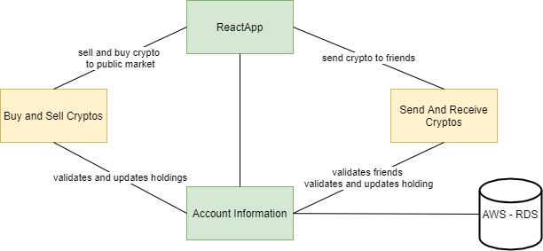
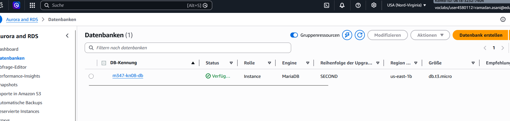
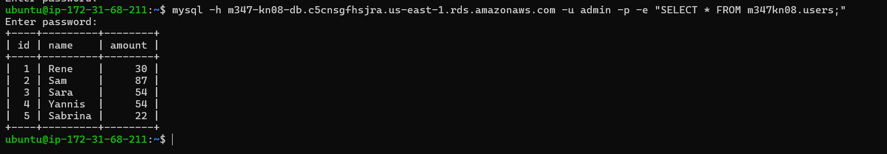
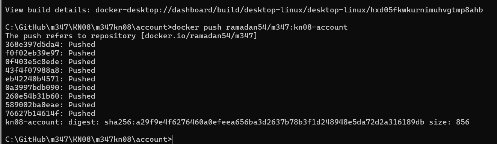
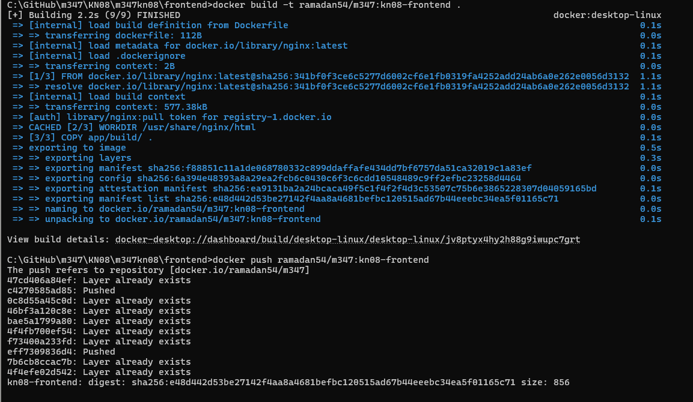
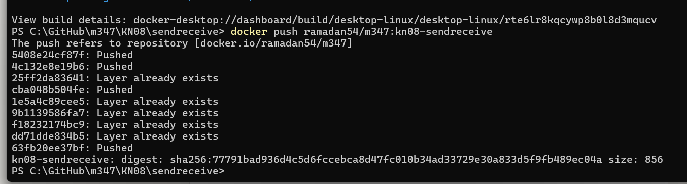
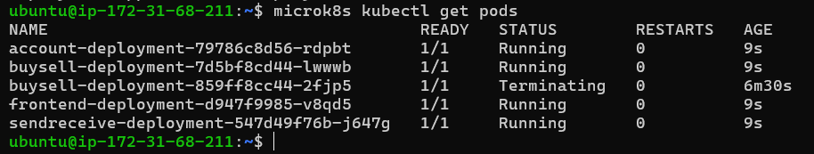
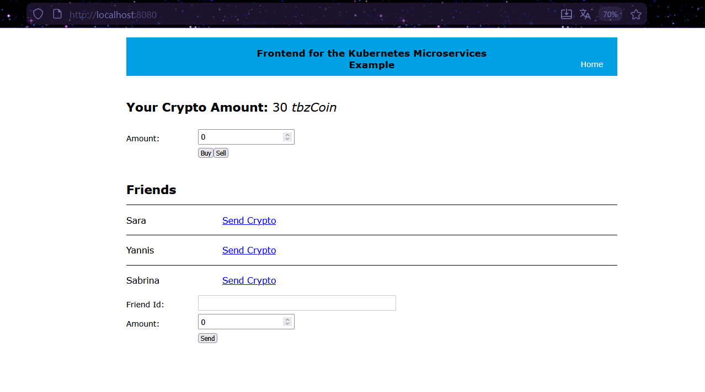
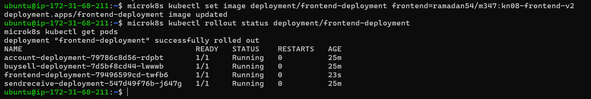
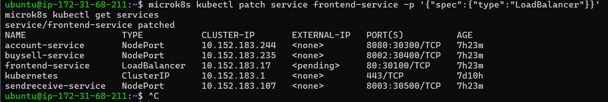

# KN08: Kubernetes III - Microservices

---

## Übersicht

In diesem Kompetenznachweis wird eine Microservice-Applikation namens **CryptoMicroservices** vollständig deployed. Die Applikation besteht aus 4 Services, die miteinander kommunizieren.

| Service         | Beschreibung                                        | Status               |
| --------------- | --------------------------------------------------- | -------------------- |
| **Frontend**    | React App – vorgegeben, gebaut und containerisiert  | Vorgegeben           |
| **Account**     | Verwaltet Holdings und Freunde, kommuniziert mit DB | Vorgegeben           |
| **BuySell**     | Kaufen/Verkaufen von tbzCoins                       | Selbst implementiert |
| **SendReceive** | Coins an Freunde senden                             | Selbst implementiert |

**Architektur:**



---

## 1. Datenbank erstellen

Die Microservices verwenden eine **MariaDB** Datenbank auf AWS RDS.

### AWS RDS MariaDB erstellen

In der AWS Console wurde unter RDS eine neue Datenbank erstellt mit folgenden Einstellungen:

| Einstellung            | Wert                |
| ---------------------- | ------------------- |
| Engine                 | MariaDB             |
| Template               | Sandbox (Free Tier) |
| DB Instance Identifier | m347-kn08-db        |
| Master Username        | admin               |
| Instance Class         | db.t3.micro         |
| Öffentlicher Zugriff   | Ja                  |

**Screenshot: RDS Datenbank verfügbar:**



### SQL Daten importieren

Die Beispieldaten wurden über einen EC2 Node importiert:

```bash
# MySQL Client installieren
sudo apt-get update && sudo apt-get install mysql-client -y

# SQL Datei importieren
mysql -h m347-kn08-db.c5cnsgfhsjra.us-east-1.rds.amazonaws.com -u admin -p < m347_KN08_DB.sql
```

| Befehl                                       | Erklärung                                                        |
| -------------------------------------------- | ---------------------------------------------------------------- |
| `sudo apt-get install mysql-client`          | Installiert den MySQL Client auf dem Ubuntu Node                 |
| `mysql -h <endpoint> -u admin -p < file.sql` | Verbindet sich mit der RDS Datenbank und führt die SQL Datei aus |

**Screenshot: Datenbank mit Beispieldaten:**



Die Datenbank enthält folgende Testdaten:

| ID  | Name    | Amount (tbzCoins) |
| --- | ------- | ----------------- |
| 1   | Rene    | 30                |
| 2   | Sam     | 87                |
| 3   | Sara    | 54                |
| 4   | Yannis  | 54                |
| 5   | Sabrina | 22                |

### Security Group anpassen

In der AWS Security Group wurde Port 3306 (MySQL/MariaDB) für eingehenden Datenverkehr geöffnet:

| Typ          | Protokoll | Port    | Quelle    |
| ------------ | --------- | ------- | --------- |
| MySQL/Aurora | TCP       | 3306    | 0.0.0.0/0 |
| Alle TCP     | TCP       | 0-65535 | 0.0.0.0/0 |

---

## 2. Account Service containerisieren

Der Account Service ist ein .NET Microservice der vorgegeben wurde.

### appsettings.json konfigurieren

Die Datei `appsettings-template.json` wurde kopiert und mit den DB-Verbindungsdaten angepasst:

```powershell
copy account\bin\appsettings-template.json account\bin\appsettings.json
```

Inhalt der `appsettings.json`:

```json
{
  "Logging": {
    "LogLevel": {
      "Default": "Information",
      "Microsoft.AspNetCore": "Warning"
    }
  },
  "AllowedHosts": "*",
  "ConnectionString": "Server=m347-kn08-db.c5cnsgfhsjra.us-east-1.rds.amazonaws.com;Database=m347kn08;User ID=admin;Password=m347Password1;"
}
```

### Dockerfile Account

```dockerfile
# Build runtime image
FROM mcr.microsoft.com/dotnet/aspnet:8.0-alpine
WORKDIR /App
COPY bin .
EXPOSE 8080
ENTRYPOINT ["dotnet", "/App/account.dll"]
```

| Befehl                                            | Erklärung                                                            |
| ------------------------------------------------- | -------------------------------------------------------------------- |
| `FROM mcr.microsoft.com/dotnet/aspnet:8.0-alpine` | Verwendet das offizielle .NET ASP.NET Runtime Image (Alpine = klein) |
| `WORKDIR /App`                                    | Setzt das Arbeitsverzeichnis im Container                            |
| `COPY bin .`                                      | Kopiert den kompilierten Code inkl. appsettings.json                 |
| `EXPOSE 8080`                                     | Öffnet Port 8080 im Container                                        |
| `ENTRYPOINT ["dotnet", "/App/account.dll"]`       | Startet die .NET Applikation                                         |

### Container bauen und pushen

```bash
docker build -t ramadan54/m347:kn08-account .
docker push ramadan54/m347:kn08-account
```

| Befehl                                          | Erklärung                                        |
| ----------------------------------------------- | ------------------------------------------------ |
| `docker build -t ramadan54/m347:kn08-account .` | Baut das Docker Image mit dem Tag `kn08-account` |
| `docker push ramadan54/m347:kn08-account`       | Lädt das Image auf Docker Hub hoch               |

**Screenshot: Account Image gepusht:**



---

## 3. Frontend containerisieren

Das Frontend ist eine React App die vorgegeben wurde.

### Environment Variablen konfigurieren

Für Kubernetes wurden die `.env.production` Variablen mit nginx Reverse Proxy Pfaden konfiguriert:

```
REACT_APP_ACCOUNT_HOLDINGS=/api/account/Account/Cryptos/?userid=<userId>
REACT_APP_ACCOUNT_FRIENDS=/api/account/Account/Friends/?userid=<userId>
REACT_APP_BUYSELL_BUY=/api/buysell/buy
REACT_APP_BUYSELL_SELL=/api/buysell/sell
REACT_APP_SENDRECEIVE_SEND=/api/sendreceive/send
REACT_APP_USER_LOGGED_IN=1
```

### Frontend builden

```bash
cd frontend/app
npm install
npm run build
```

| Befehl          | Erklärung                                                |
| --------------- | -------------------------------------------------------- |
| `npm install`   | Installiert alle Node.js Abhängigkeiten                  |
| `npm run build` | Erstellt optimierte Produktionsdateien im `build` Ordner |

### nginx Konfiguration (Reverse Proxy)

Da die React App im Browser läuft und CORS-Probleme entstehen würden, wurde ein nginx Reverse Proxy eingesetzt. Alle API Calls gehen über denselben Port 80:

```nginx
server {
    listen 80;

    location / {
        root /usr/share/nginx/html;
        index index.html;
        try_files $uri $uri/ /index.html;
    }

    location /api/account/ {
        proxy_pass http://account-service:8080/;
    }

    location /api/buysell/ {
        proxy_pass http://buysell-service:8002/;
    }

    location /api/sendreceive/ {
        proxy_pass http://sendreceive-service:8003/;
    }
}
```

| Location            | Erklärung                                                    |
| ------------------- | ------------------------------------------------------------ |
| `/`                 | Liefert die React App Static Files aus                       |
| `/api/account/`     | Leitet Requests weiter an den Account Kubernetes Service     |
| `/api/buysell/`     | Leitet Requests weiter an den BuySell Kubernetes Service     |
| `/api/sendreceive/` | Leitet Requests weiter an den SendReceive Kubernetes Service |

### Dockerfile Frontend

```dockerfile
FROM nginx
WORKDIR /usr/share/nginx/html
COPY app/build/ .
COPY nginx.conf /etc/nginx/conf.d/default.conf
EXPOSE 80
```

### Container bauen und pushen

```bash
docker build -t ramadan54/m347:kn08-frontend .
docker push ramadan54/m347:kn08-frontend
```

**Screenshot: Frontend Image gepusht:**



---

## 6. BuySell und SendReceive implementieren

Die beiden Services wurden selbst in **Node.js** implementiert.

### BuySell Service

Der BuySell Service ermöglicht das Kaufen und Verkaufen von tbzCoins. Er ruft im Hintergrund den Account Service auf.

**Endpoints:**

| Endpoint | Methode | Parameter                 | Response     |
| -------- | ------- | ------------------------- | ------------ |
| `/buy`   | POST    | `{"id": 1, "amount": 21}` | `true/false` |
| `/sell`  | POST    | `{"id": 1, "amount": 21}` | `true/false` |

**index.js:**

```javascript
const express = require("express");
const cors = require("cors");
const fetch = (...args) =>
  import("node-fetch").then(({ default: fetch }) => fetch(...args));
const app = express();
app.use(cors());
app.use(express.json());

const ACCOUNT_URL = process.env.ACCOUNT_SERVICE_URL || "http://localhost:8080";

app.post("/buy", async (req, res) => {
  try {
    const { id, amount } = req.body;
    const response = await fetch(ACCOUNT_URL + "/Account/Cryptos/Add", {
      method: "POST",
      headers: { "Content-Type": "application/json" },
      body: JSON.stringify({ userId: id, amount: amount }),
    });
    const result = await response.json();
    res.json(result);
  } catch (e) {
    res.json(false);
  }
});

app.post("/sell", async (req, res) => {
  try {
    const { id, amount } = req.body;
    const response = await fetch(ACCOUNT_URL + "/Account/Cryptos/Remove", {
      method: "POST",
      headers: { "Content-Type": "application/json" },
      body: JSON.stringify({ userId: id, amount: amount }),
    });
    const result = await response.json();
    res.json(result);
  } catch (e) {
    res.json(false);
  }
});

app.listen(8002, () => console.log("BuySell running on port 8002"));
```

**Dockerfile BuySell:**

```dockerfile
FROM node:18-alpine
WORKDIR /app
COPY package.json .
RUN npm install
COPY index.js .
EXPOSE 8002
CMD ["node", "index.js"]
```

### SendReceive Service

Der SendReceive Service ermöglicht das Senden von tbzCoins an Freunde.

**Endpoint:**

| Endpoint | Methode | Parameter                                  | Response     |
| -------- | ------- | ------------------------------------------ | ------------ |
| `/send`  | POST    | `{"id": 1, "receiverId": 2, "amount": 21}` | `true/false` |

**index.js:**

```javascript
const express = require("express");
const cors = require("cors");
const fetch = (...args) =>
  import("node-fetch").then(({ default: fetch }) => fetch(...args));
const app = express();
app.use(cors());
app.use(express.json());

const ACCOUNT_URL = process.env.ACCOUNT_SERVICE_URL || "http://localhost:8080";

app.post("/send", async (req, res) => {
  try {
    const { id, receiverId, amount } = req.body;
    const response = await fetch(ACCOUNT_URL + "/Account/Cryptos/Send", {
      method: "POST",
      headers: { "Content-Type": "application/json" },
      body: JSON.stringify({
        userId: id,
        receiverId: receiverId,
        amount: amount,
      }),
    });
    const result = await response.json();
    res.json(result);
  } catch (e) {
    res.json(false);
  }
});

app.listen(8003, () => console.log("SendReceive running on port 8003"));
```

**Dockerfile SendReceive:**

```dockerfile
FROM node:18-alpine
WORKDIR /app
COPY package.json .
RUN npm install
COPY index.js .
EXPOSE 8003
CMD ["node", "index.js"]
```

### Alle Images pushen

```bash
docker push ramadan54/m347:kn08-buysell
docker push ramadan54/m347:kn08-sendreceive
```

**Screenshot: Alle Images auf Docker Hub:**



---

## 7. Kubernetes realisieren

### ConfigMap

Die ConfigMap enthält die URL des Account Services, damit BuySell und SendReceive diesen finden können:

```yaml
apiVersion: v1
kind: ConfigMap
metadata:
  name: crypto-config
data:
  account-service-url: "http://account-service:8080"
```

| Feld                  | Erklärung                                                  |
| --------------------- | ---------------------------------------------------------- |
| `kind: ConfigMap`     | Kubernetes Ressourcentyp für Konfigurationsdaten           |
| `account-service-url` | Die interne Kubernetes Service URL für den Account Service |

### Secret

Das Secret enthält die base64-kodierte Datenbankverbindung:

```yaml
apiVersion: v1
kind: Secret
metadata:
  name: crypto-secret
type: Opaque
data:
  db-connection: U2VydmVyPW0zNDcta24wOC1kYi5jNWNuc2dmaHNqcmEudXMtZWFzdC0xLnJkcy5hbWF6b25hd3MuY29tO0RhdGFiYXNlPW0zNDdrbjA4O1VzZXIgSUQ9YWRtaW47UGFzc3dvcmQ9bTM0N1Bhc3N3b3JkMTs=
```

| Feld           | Erklärung                                  |
| -------------- | ------------------------------------------ |
| `type: Opaque` | Generischer Secret-Typ für beliebige Daten |
| `data`         | Enthält Base64-kodierte Key-Value Paare    |

### Deployments und Services

Alle 4 Services wurden in einer `deployments.yaml` Datei definiert:

```yaml
apiVersion: apps/v1
kind: Deployment
metadata:
  name: account-deployment
spec:
  replicas: 1
  selector:
    matchLabels:
      app: account
  template:
    metadata:
      labels:
        app: account
    spec:
      containers:
        - name: account
          image: ramadan54/m347:kn08-account
          ports:
            - containerPort: 8080
---
apiVersion: v1
kind: Service
metadata:
  name: account-service
spec:
  selector:
    app: account
  ports:
    - protocol: TCP
      port: 8080
      targetPort: 8080
---
apiVersion: apps/v1
kind: Deployment
metadata:
  name: buysell-deployment
spec:
  replicas: 1
  selector:
    matchLabels:
      app: buysell
  template:
    metadata:
      labels:
        app: buysell
    spec:
      containers:
        - name: buysell
          image: ramadan54/m347:kn08-buysell
          ports:
            - containerPort: 8002
          env:
            - name: ACCOUNT_SERVICE_URL
              valueFrom:
                configMapKeyRef:
                  name: crypto-config
                  key: account-service-url
---
apiVersion: v1
kind: Service
metadata:
  name: buysell-service
spec:
  selector:
    app: buysell
  ports:
    - protocol: TCP
      port: 8002
      targetPort: 8002
---
apiVersion: apps/v1
kind: Deployment
metadata:
  name: sendreceive-deployment
spec:
  replicas: 1
  selector:
    matchLabels:
      app: sendreceive
  template:
    metadata:
      labels:
        app: sendreceive
    spec:
      containers:
        - name: sendreceive
          image: ramadan54/m347:kn08-sendreceive
          ports:
            - containerPort: 8003
          env:
            - name: ACCOUNT_SERVICE_URL
              valueFrom:
                configMapKeyRef:
                  name: crypto-config
                  key: account-service-url
---
apiVersion: v1
kind: Service
metadata:
  name: sendreceive-service
spec:
  selector:
    app: sendreceive
  ports:
    - protocol: TCP
      port: 8003
      targetPort: 8003
---
apiVersion: apps/v1
kind: Deployment
metadata:
  name: frontend-deployment
spec:
  replicas: 1
  selector:
    matchLabels:
      app: frontend
  template:
    metadata:
      labels:
        app: frontend
    spec:
      containers:
        - name: frontend
          image: ramadan54/m347:kn08-frontend
          ports:
            - containerPort: 80
---
apiVersion: v1
kind: Service
metadata:
  name: frontend-service
spec:
  type: NodePort
  selector:
    app: frontend
  ports:
    - protocol: TCP
      port: 80
      targetPort: 80
      nodePort: 30100
```

### Deployment auf Kubernetes

```bash
microk8s kubectl apply -f configmap.yaml
microk8s kubectl apply -f secret.yaml
microk8s kubectl apply -f deployments.yaml
```

| Befehl                                       | Erklärung                                           |
| -------------------------------------------- | --------------------------------------------------- |
| `microk8s kubectl apply -f configmap.yaml`   | Erstellt/aktualisiert die ConfigMap im Cluster      |
| `microk8s kubectl apply -f secret.yaml`      | Erstellt/aktualisiert das Secret im Cluster         |
| `microk8s kubectl apply -f deployments.yaml` | Erstellt/aktualisiert alle Deployments und Services |

**Screenshot: Alle Pods laufen:**



### Laufende App

**Screenshot: Applikation läuft mit Daten:**



Die App zeigt korrekt:

- **Your Crypto Amount: 30 tbzCoin** (User Rene, ID=1)
- **Friends: Sara, Yannis, Sabrina** (Freunde von Rene aus der Datenbank)

---

## 8. App Update

Kubernetes ermöglicht Updates ohne Downtime (Rolling Update). Als Beispiel wurde das Frontend Image aktualisiert.

### Vorgehen

1. Applikation aktualisieren (neue `.env.production` Werte)
2. Neues Image bauen und pushen
3. Deployment mit neuem Image aktualisieren

```bash
# Neues Image bauen und pushen
docker build -t ramadan54/m347:kn08-frontend-v5 .
docker push ramadan54/m347:kn08-frontend-v5

# Deployment mit neuem Image aktualisieren
microk8s kubectl set image deployment/frontend-deployment frontend=ramadan54/m347:kn08-frontend-v5

# Rollout Status prüfen
microk8s kubectl rollout status deployment/frontend-deployment
```

| Befehl                                                    | Erklärung                                                   |
| --------------------------------------------------------- | ----------------------------------------------------------- |
| `kubectl set image deployment/<name> <container>=<image>` | Aktualisiert das Image eines Containers in einem Deployment |
| `kubectl rollout status deployment/<name>`                | Zeigt den Status des Rollouts – wartet bis fertig           |

**Screenshot: Rollout erfolgreich:**



Kubernetes fährt dabei die alten Pods sukzessive herunter und startet neue Pods mit dem neuen Image – ohne Unterbruch des Dienstes. Das ist die eigentliche Stärke von Kubernetes für CI/CD.

---

## 9. Verbesserung 1: nginx Reverse Proxy und Environmentvariablen

### Problem

Die React App wird im Browser des Benutzers ausgeführt. Wenn das Frontend auf `localhost:8080` läuft und versucht `localhost:30300` (Account Service) aufzurufen, entsteht ein CORS-Problem (Cross-Origin Resource Sharing).

### Lösung: nginx als Reverse Proxy

Alle API Calls gehen über denselben Host (Port 80 des Frontend Service). nginx leitet die Requests intern an die entsprechenden Kubernetes Services weiter:

```
Browser → /api/account/... → nginx → account-service:8080
Browser → /api/buysell/...  → nginx → buysell-service:8002
Browser → /api/sendreceive/... → nginx → sendreceive-service:8003
```

Die `nginx.conf` wurde ins Dockerfile kopiert:

```dockerfile
FROM nginx
WORKDIR /usr/share/nginx/html
COPY app/build/ .
COPY nginx.conf /etc/nginx/conf.d/default.conf
EXPOSE 80
```

### Environment Variablen

Die `.env.production` Datei enthält die Pfade für den Kubernetes-Betrieb:

```
REACT_APP_ACCOUNT_HOLDINGS=/api/account/Account/Cryptos/?userid=<userId>
REACT_APP_ACCOUNT_FRIENDS=/api/account/Account/Friends/?userid=<userId>
REACT_APP_BUYSELL_BUY=/api/buysell/buy
REACT_APP_BUYSELL_SELL=/api/buysell/sell
REACT_APP_SENDRECEIVE_SEND=/api/sendreceive/send
REACT_APP_USER_LOGGED_IN=1
```

Diese Variablen werden während `npm run build` in den JavaScript Code eingebaut (hardcodiert). Das bedeutet: für eine andere Umgebung muss das Frontend neu gebaut werden.

---

## 10. Verbesserung 2: LoadBalancer

### Problem

Bisher wurde der Frontend Service als `NodePort` konfiguriert. Das bedeutet, der Benutzer muss die IP eines spezifischen Nodes kennen. Fällt dieser Node aus, ist die App nicht mehr erreichbar.

### Lösung: LoadBalancer

Der Service Type wurde von `NodePort` auf `LoadBalancer` geändert:

```bash
microk8s kubectl patch service frontend-service -p '{"spec":{"type":"LoadBalancer"}}'
```

```bash
microk8s kubectl get services
```

Ausgabe:

```
NAME                  TYPE           CLUSTER-IP       EXTERNAL-IP   PORT(S)
frontend-service      LoadBalancer   10.152.183.17    <pending>     80:30100/TCP
```

| Service Type   | Erklärung                                                                                   |
| -------------- | ------------------------------------------------------------------------------------------- |
| `ClusterIP`    | Nur intern im Cluster erreichbar (Standard)                                                 |
| `NodePort`     | Erreichbar über IP eines beliebigen Nodes + Port                                            |
| `LoadBalancer` | Erstellt einen externen Load Balancer (z.B. AWS ELB) der den Traffic auf die Nodes verteilt |

Der Status `<pending>` bei der External-IP ist normal in einer MicroK8s Umgebung ohne integrierten Cloud LoadBalancer. In einer vollständigen AWS EKS Umgebung würde automatisch ein AWS Elastic Load Balancer erstellt werden.

**Screenshot: LoadBalancer Service:**



Der Vorteil des LoadBalancers gegenüber NodePort: Der Traffic wird automatisch auf alle verfügbaren Nodes verteilt. Muss ein Node gewartet oder ausgetauscht werden, leitet der LoadBalancer den Traffic automatisch auf die anderen Nodes um.

---

## Zusammenfassung aller verwendeten Befehle

```bash
# Datenbank
sudo apt-get update && sudo apt-get install mysql-client -y
mysql -h <endpoint> -u admin -p < m347_KN08_DB.sql
mysql -h <endpoint> -u admin -p -e "SELECT * FROM m347kn08.users;"

# Docker Images bauen und pushen
docker build -t ramadan54/m347:kn08-account .
docker build -t ramadan54/m347:kn08-frontend .
docker build -t ramadan54/m347:kn08-buysell .
docker build -t ramadan54/m347:kn08-sendreceive .
docker push ramadan54/m347:kn08-account
docker push ramadan54/m347:kn08-frontend
docker push ramadan54/m347:kn08-buysell
docker push ramadan54/m347:kn08-sendreceive

# Frontend builden
cd frontend/app
npm install
npm run build

# Kubernetes deployen
microk8s kubectl apply -f configmap.yaml
microk8s kubectl apply -f secret.yaml
microk8s kubectl apply -f deployments.yaml

# Status prüfen
microk8s kubectl get pods
microk8s kubectl get services
microk8s kubectl get pods -o wide

# App Update
microk8s kubectl set image deployment/frontend-deployment frontend=ramadan54/m347:kn08-frontend-v5
microk8s kubectl rollout status deployment/frontend-deployment
microk8s kubectl rollout restart deployment <name>

# Service Type ändern
microk8s kubectl patch service frontend-service -p '{"spec":{"type":"LoadBalancer"}}'

# Services als NodePort exponieren
microk8s kubectl patch service account-service -p '{"spec":{"type":"NodePort","ports":[{"port":8080,"targetPort":8080,"nodePort":30300}]}}'
microk8s kubectl patch service buysell-service -p '{"spec":{"type":"NodePort","ports":[{"port":8002,"targetPort":8002,"nodePort":30400}]}}'
microk8s kubectl patch service sendreceive-service -p '{"spec":{"type":"NodePort","ports":[{"port":8003,"targetPort":8003,"nodePort":30500}]}}'

# Pods löschen
microk8s kubectl delete pods --field-selector=status.phase=Failed
microk8s kubectl delete deployment <name>
microk8s kubectl delete service <name>
```
